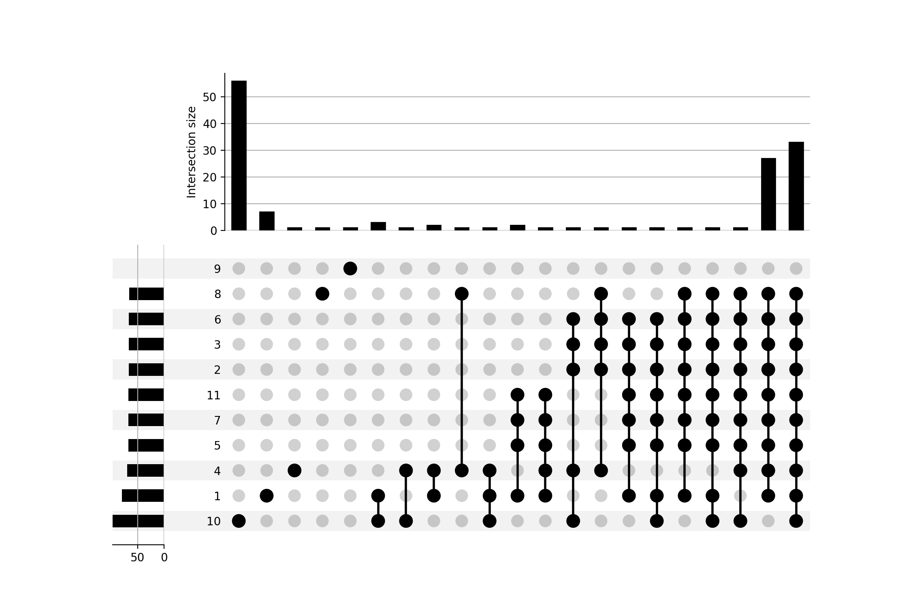

# Figure 6 manuscript ISMB

Input data:
- the counts.txt file for each of the 11 group to be found in each subdirectory groupX. This is the file generated by feature counts.
- dge.csv for each of the 11 group to be found in each subdirectory groupX. This is the list of differentially expressed genes provided by the student after the DESeq2 analysis.
  fluctuations occur due to various choices made by students (e.g. fold change threshold, normalisation, etc)- 
  
To generate the image, simply clone the repository:

    git clone git@github.com:fredericlemoine/reprohackathon_ismb2023.git
    cd reprohackathon_ismb202/figure_upsetplot
    snakemake -s Snakefile --use-singularity -c 4
    
the singularity/apptainer is used to download an image with a specific version of R/DESeq2 package to ensure full reproducibility of the R computation. For Python, the Snakemake file relies on pandas, UpSetPlot and Snakemake. Figure generated with pandas 1.5.3, UpSetPlot 0.8.0 and snakemake 7.20.0.

upset plot using DGE results from students:

upset plot using DGE results from unique R script:

